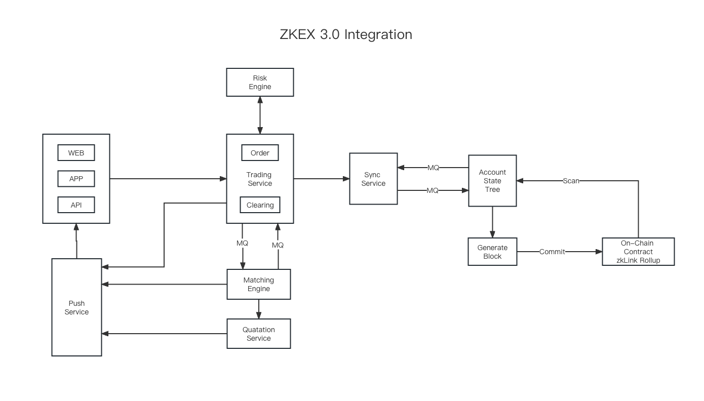

# Heavyweight Integration (Multi-Chain Derivatives & Spot Exchange)

> 💡 A case study of ZKEX 3.0: a multi-chain derivatives & spot exchange with a unified account

The graphic below outlines how to integrate zkLink functional components in a decentralized way. This highly flexible integration model enhances dApps’ business customizability and autonomous cost management.

## Integration Features

* Autonomous account state-tree maintenance and on-chain event monitoring, eliminating the dependence on third-party services and ensuring stronger business reliability
* Independent transaction ordering and block generation logic defined according to specific business logic
* Autonomous data commitment to the Data Availability Layer (DA): The gas fees of on-chain data commitment are directly paid by the dApps, enabling proactive management of network operational costs

## Functions of ZKEX 3.0 Integration

* High-performing order matching of spot and derivatives
* High-performing risk engine for perpetual contracts
* Unified accounts for perpetual contracts and spot trading for better UX and higher capital efficiency
* Cross-margin for perpetual contracts

