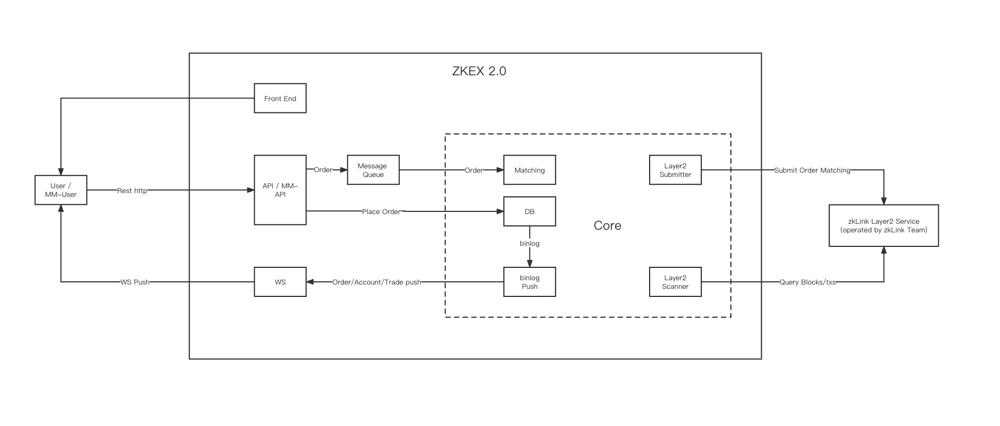

# Simple Integration (Multi-Chain Spot Exchange)

***

The graphic below illustrates an example integration of zkLink infrastructure with ZKEX2.0, and demonstrates how to quickly deploy a decentralized multi-chain spot exchange based on the CLOB model (Central Limit Order Book).

## Integration Features

* Autonomous maintenance of user asset information, designing for high-performing order matching
* Easy deployment and transaction settlement with plug-and-play APIs; direct connection to the sequencer system operated by zkLink team
* Easy gas fee handling across different public chains

## Functions of ZKEX 2.0 Integration

* Multi-chain orderbook spot trading
* Multi-chain spot asset conversion
