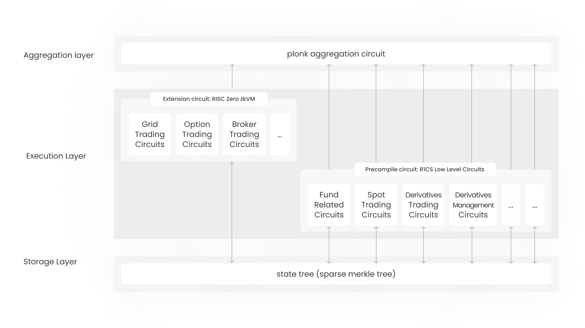
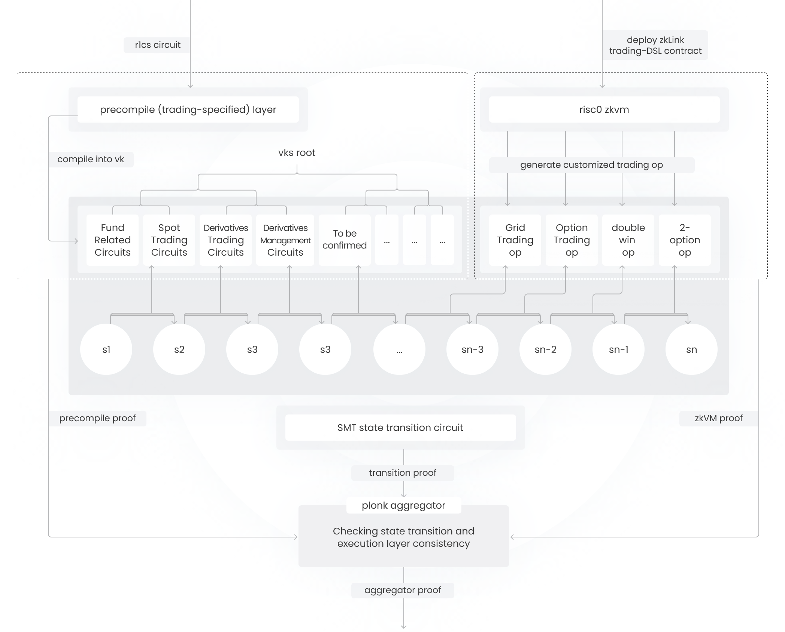

# TS-zkVM for App Rollup

zkLink Trading-Specific-zkVM (TS-zkVM) is based on tailored core ZK circuits and Risc0 zkVM extension ZK circuits. The TS-zkVM offers high-throughput and low-cost execution for App Rollup developers. It supports various order book product features, including but not limited to spot trading, derivatives trading, NFT trading, etc.

Different developers and applications may have varying requirements for cost and security, zkLink App Rollup developers are able to compose the key components including DA, Sequencer, and Settlement layer.

<figure><figcaption>
TS-zkVM architecture
</figcaption></figure>

The diagram in the figure above shows a high-level overview of the TS-zkVM architecture, which is divided into three sub-layers.

#### 4.1.1 Storage sub-layer of TS-zkVM

The storage of zkLink protocol utilizes a Sparse Merkle Tree (SMT) to store the state. This data structure provides the system with an efficient and secure way to maintain and verify changes in the state. Compared to the SMT in the EVM, the customized and optimized SMT of zkLink TS-zkVM is more streamlined and better adapted to the needs of high-frequency financial transaction scenarios. With in-depth customization, the SMT has been specifically tailored to suit particular business needs, thereby achieving exceptional zero-knowledge proof performance.

#### 4.1.2 Execution sub-layer of TS-zkVM

The execution sub-layer of TS-zkVM is divided into two parts, each designed for different performance and scalability requirements:

*   **Precompiled circuit**: Requires high performance and includes various transaction-related circuits, such as:

    * Fund Related Circuits (Deposit, Withdrawal, Transfer)
    * Spot Trading Circuits
    * Derivatives Trading Circuits
    * Derivatives Management Circuits (Liquidation, ADL, Funding)
    * Oracle Verification Circuits
    * Authorization Circuits (Passkey Verification, Social Login Verification)

    These circuits are specifically optimized to handle corresponding financial transactions, ensuring efficiency and high response speed when the system processes transactions. Each sub-circuit corresponds to different types of transaction operations or financial instruments and handles the most performance-intensive tasks.
*   **Extension circuit:** The extension circuit is built using risc0 zkVM on the same Sparse Merkle Tree (SMT), and the proofs generated by the zkVM are subsequently verified by the plonk aggregation circuit in the aggregation layer. Developers can perform custom operations using risc0 zkVM, such as:

    * Grid Trading Circuits
    * Option Trading Circuits
    * Broker Trading Circuits
    * …

    A SDK based on risc0 zkVM will be provided, which includes common operations on the TS-zkVM SMT, such as: verifying a Merkle Tree Proof for a specific account, checking if the balance change of an account complies with certain patterns, etc.

    Of course, for common features like Grid Trading and Broker Trading, zkLink will have prepared corresponding circuit templates in advance to enable developers to build quickly.

#### 4.1.3 ZK Proof Aggregation sub-layer of TS-zkVM

The aggregation sub-layer is responsible for aggregating the different transaction proofs and producing a proof to verify the correctness of the entire batch of transactions, which achieves increased efficiency in proof verification and reduced on-chain costs for transactions.

<figure><figcaption>
Aggregation Detail of TS-zkVM
</figcaption></figure>

The aggregation sub-layer is composed of the following modules:

* **Precompile Module**: This module includes trading-specified precompiled circuits, which need to be compiled into verification keys (vk). This provides the system with a flexible way to generate customized circuits for specific types of transactions and integrate them into the entire verification system.
* **SMT State Transition Circuit**: The state transition circuit uses an SMT to record states, with changes in the root representing all users' ledger changes, ensuring the correctness and consistency of the system state. Each state transition (S1, S2, S3, ..., Sn) is constrained by the circuit to generate a transition proof.
* **zkVM**: This section demonstrates how to deploy zkLink Trading-DSL contracts using risc0 zkVM to generate custom trading operations (op). This mechanism allows users to customize trading logic and ensures that these logics are correctly executed and verified.
* **PLONK Aggregator**: The PLONK aggregator is responsible for checking the consistency of state transitions and the execution layer. It integrates proofs from different sources and generates an aggregated proof. This process enhances verification efficiency and reduces the costs required for on-chain verification.
* **Proofs**: The architecture includes various types of proofs:
  * **Precompile Proof**: Ensures the correctness of the precompile layer.
  * **Transition Proof**: Ensures the correctness of state transitions.
  * **zkVM Proof**: Ensures the correctness of custom trading operations.

**Interactions Between Modules:**

* Application Specific Circuits are eventually compiled into **verification keys**, and these verification keys are stored in the root node of the vk tree.
* zkVM allows for the deployment of **Trading-DSL** contracts, generating custom trading operations.
* Precompiled circuits, risc0 zkVM, and SMT State Transition Circuits are interconnected, ensuring the correctness of each state change.
* All proofs are collected by the Aggregator and verified in the aggregation circuit — to check if the transition set commitment in the transition proof is included in the **(Algorithm id, Input, Output)** tuple vector of the precompile proof and zkVM proof, a membership proof verification is also needed in the aggregation circuit. This ultimately produces an Aggregation Proof for on-chain verification.
