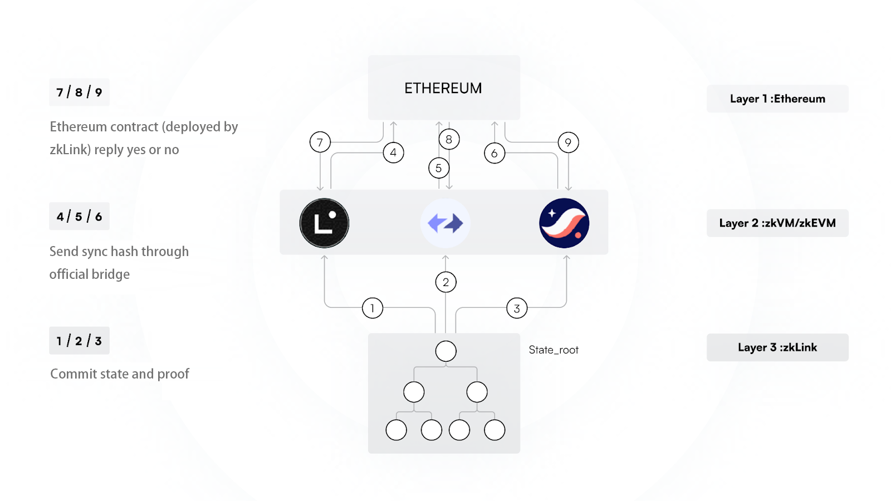
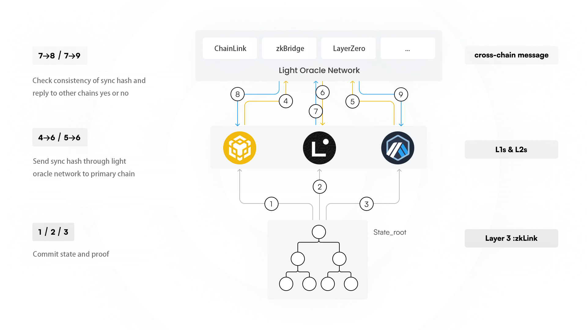

# Multi-Chain State Synchronization

## 1. Deposit fraud prevention: Multi-chain infra security challenge

The main challenge of building a unified trading infra natively deployed across various networks is the risk of **deposit fraud**. When having multiple chains or rollups in the same setup, each network is isolated – they are not able to perceive the states of the others because they can not directly access external information.

When the fund deposit information from the different chains need to converge within zkLink protocol, the potential for deposit fraud emerges. A bad sequencer may falsely inform the primary chain about a fake deposit on one secondary chain, e.g, the sequencer may inform the primary chain about a 100 USDT deposit on a secondary chain which may not exist. In such scenarios, without effective verification mechanisms, it could lead to loss of user funds.

The challenge centers on guaranteeing the states consistency between the primary chain and the secondary chains. Therefore, it could be stated that the issue of deposit fraud is fundamentally a matter of multi-chain state consistency. To address this issue, we need a verification mechanism that is both fast and secure, ensuring all chains stay synchronized, and no one can alter or falsify information.

## 2. Nexus solution: multi-chain state synchronization via Ethereum

All networks connected with zkLink Nexus have to be Rollup L2s deployed on Ethereum, which communicates with Ethereum through the official rollup bridges.

Firstly, zkLink Nexus L3 sequencer will commit state and proof to the primary chain(assuming Linea is the primary chain) in step 1, 2, 3, as is shown in the figure below.&#x20;

Secondly, the primary chain Linea computes the sync hash of Starknet and zkSync (secondary chains) and posts it to the Ethereum contract in step 4. In the meantime, the secondary chains, Starknet and zkSync will compute and post their sync hashes representing the deposit history to the Ethereum contract in steps 5 and 6.

Thirdly, the Ethereum contract will compare the sync hash from Linea with the sync hashes from Starknet and zkSync. If they match, confirmation messages will be sent to the contract on the three L2s through their official Ethereum rollup bridges in steps 7, 8, and 9.

This messaging mechanism allows for a secure and effective synchronization of states cross-L2s, ensuring that deposit fraud issues on the secondary chains are prevented.

<figure><figcaption>
zkLink Nexus cross-rollup states synchronization process
</figcaption></figure>

## 3. Origin solution: cross-chain state synchronization via Light Oracle Network

zkLink Origin introduces a light oracle network to facilitate the cross-chain transfer of sync hashes. The light oracle network consists of independant cross-chain general message service providers such as LayerZero, zkBridge, Chainlink, etc., which ensures decentralization of the message transfer process.

As shown in the figure below, the zkLink Origin Rollup sequencer will firstly commit state and proof to the primary chain in steps 1, 2, and 3.

Secondly, the secondary chains will post their sync hash to Linea through the light oracle network service in steps 4, 5, and 6.

Thirdly, the Primary contract computes the sync hash of all other secondary chains and compares them with the sync hashes from the secondary chains. If they match, confirmation messages will be sent back to all secondary chains through the light oracle network in steps 7, 8, and 9.

Through the process described above, the cross-chain states are synchronized fast and secure.

In addition, a user that deploys significant capital to a zkLink Orgin Rollup could apply to run a node service of the light oracle network, which will completely eliminate the risk of multi-chain deposit fraud.

<figure><figcaption>
zkLink Origin cross-chain state synchronization process
</figcaption></figure>
