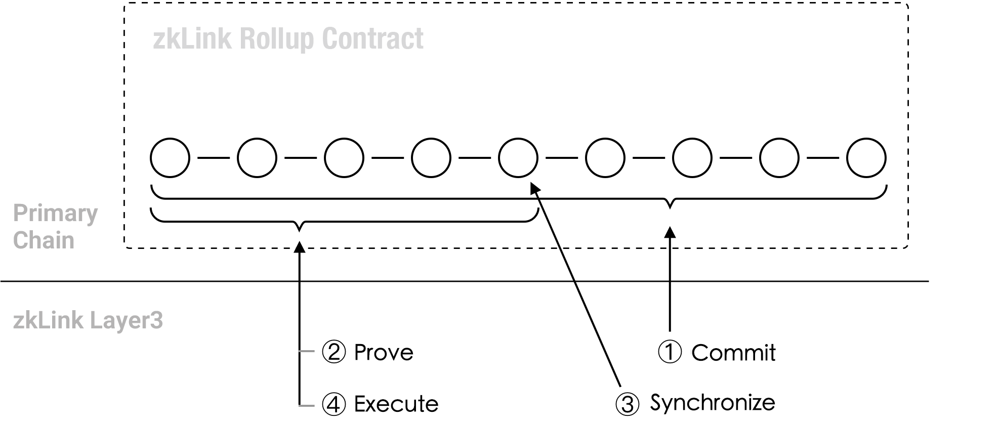

# Working Principal of A Multi-Chain ZK-Rollup

<figure><figcaption>
Working principal of a multi-chain ZK-Rollup
</figcaption></figure>

In comparison to a classic ZK-Rollup architecture, zkLink proposes a new type of ZK-Rollup architecture which requires to deploy the rollup contracts on multiple L1 blockchains and L2 networks at the same time, thus is called a multi-chain ZK-Rollup.

In the architecture of a multi-chain ZK-Rollup, in order to optimize the verification cost, one chain among the connected chains will be designated as the **primary chain**, which is responsible for ZKP verification. While the other chains will act as **secondary chains** that do not need to execute ZKP verification, through **multi-chain state synchronization**, it is equivalent to completing the verification on all chains.

The working principal of a classic ZK-Rollup settlement typically contains three stages: the Commit stage, Prove stage, and Execute stage. zkLink multi-chain ZK-Rollup architecture adds a Synchronize stage after the Prove stage.

The 4 stages are briefly described as below:

**1. Commit:** The sequencer submits the rollup data (excluding off-chain transaction data in Validium mode) to the primary chain, where the contract on the primary chain processes zero knowledge proof verification. Transactions related to secondary chains will be submitted to the primary chain as well.

**2. Prove:** ZKPs are submitted to the primary chain and verified by the smart contract. This process occurs only on the primary chain (Please note the primary chain is required to have the capability to verify zk-SNARKs proofs). For multi-chain ZK-Rollup, the transaction information related to all secondary chains will also be used by the smart contract for proof verification.

**3. Synchronize:** The purpose of the Synchronize stage is to achieve states synchronization across the connected chains.  After completing ZKP verification, the primary chain calculates the sync hashes for the different secondary chains, based on their transaction information received from the sequencer. Each secondary chain also calculates its own sync hash. If the sync hashes calculated from different sources are consistent, all connected chains will be notified that they can proceed with transaction settlement and asset withdrawal.

**4.Execute:** This step aligns with the typical process found in a classic ZK-Rollup, which involves approving requests for fund withdrawals.
