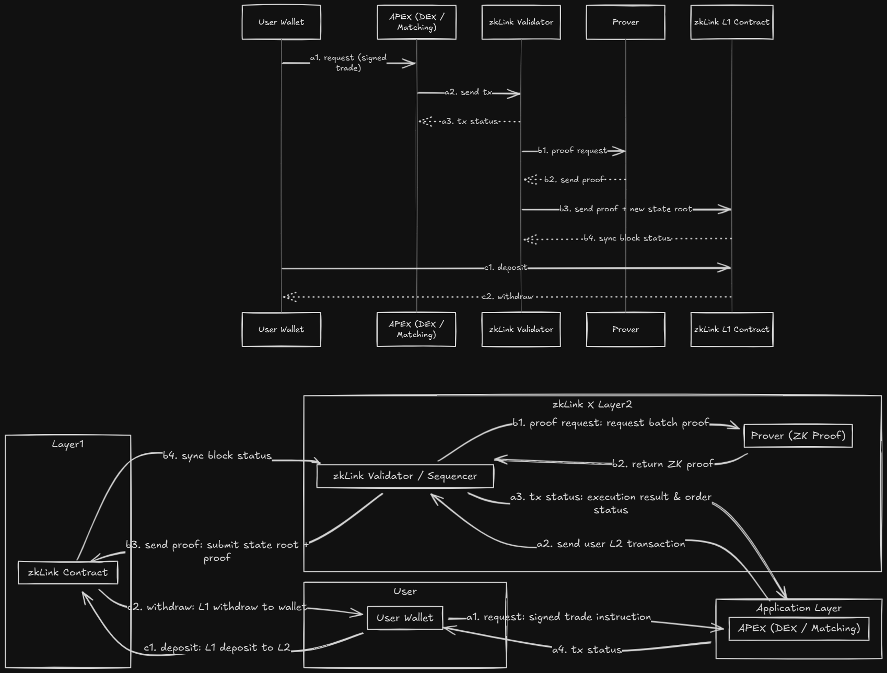

# zkLink X Transaction Flow

This section explains the end-to-end lifecycle of a transaction in zkLink X–based applications such as ApeX Omni, from when a user initiates it to when it is finally settled on Layer 1.  
You can read this together with the diagram (User Wallet / APEX / zkLink Validator / Prover / zkLink Contract).
<figure><figcaption>
zkLink-x Protocol transaction flow 
</figcaption></figure>

---

## 1. Participants

- **User Wallet**  
  The address that holds the private key, signs requests, and receives funds.

- **APEX (Application / Matching Engine Layer)**  
  A trading application built on zkLink X, responsible for:
    - Receiving user instructions (place order, cancel order, etc.);
    - Managing the order book and matching orders;
    - Sending transaction requests to the zkLink Validator.

- **zkLink Validator (Validator / Sequencer)**  
  A component of the zkLink X protocol layer, responsible for:
    - Receiving and ordering transactions from applications;
    - Executing transactions and updating Layer 2 state;
    - Requesting zero-knowledge proofs from the Prover;
    - Submitting proven state updates to the zkLink contract.

- **Prover**  
  Generates zero-knowledge proofs (ZKPs) to attest to the correctness of a batch of transactions.

- **zkLink Contract (Layer 1 Contract)**  
  The zkLink smart contracts deployed on public chains such as Ethereum, responsible for:
    - Custody of user funds (deposits/withdrawals);
    - Verifying zero-knowledge proofs;
    - Recording the latest state root.

---

## 2. Overview of the Three Main Flows

In the diagram you can see three main types of interactions (labeled with letters):

- **Series a: Transaction requests and status feedback (Application Layer ⬄ Protocol Layer)**
- **Series b: Proof generation and submission (Protocol Layer ⬄ Prover ⬄ Contract)**
- **Series c: Deposits and withdrawals (User Wallet ⬄ zkLink Contract)**

We’ll explain each in turn.

---

## 3. Transaction Requests and Feedback (a1–a3)

### a1. User Wallet → APEX: Request

1. The user performs an action in the ApeX frontend (e.g., place order, cancel order, adjust position).
2. The frontend asks the user to sign the request with their wallet:
    - To prove that this operation is authorized by that address;
    - To prevent the application from forging user instructions.
3. The signed request is sent to the APEX backend.

### a2. APEX → zkLink Validator: Send Transaction

1. APEX packages the user’s request into the zkLink X Layer 2 transaction format.
2. It submits these transactions to the zkLink Validator:
    - The Validator performs basic checks (signature, format, balance, etc.);
    - Valid transactions are added to the current pending batch.

### a3. zkLink Validator → APEX: Return Transaction Status

1. The Validator executes the transactions on Layer 2 and updates its internal state:
    - Updates balances, positions, order statuses, etc.;
    - Temporarily records them in an off-chain state tree.
2. After execution, the Validator returns the result to APEX:
    - Success: includes fill details, latest positions, etc.;
    - Failure: returns the error reason (insufficient balance, abnormal price, etc.).
3. APEX updates the UI based on the result and shows the latest state to the user.

> Note: At this point, the state still only exists on Layer 2. Final security is guaranteed later by the **series b ZK proofs + Layer 1 submission**.

---

## 4. Zero-Knowledge Proofs and Block Synchronization (b1–b4)

### b1. zkLink Validator → Prover: Proof Request

When a sufficient number of transactions has accumulated:

1. The Validator bundles the execution trace of this batch and the corresponding state changes;
2. It sends a proof request to the Prover, asking it to generate the relevant zero-knowledge proof.

### b2. Prover → zkLink Validator: Return Proof

1. The Prover generates a ZKP based on the batched transactions and execution results:
    - Proving that all transactions follow the protocol rules;
    - Proving that no coins are created out of thin air, and balances never go negative;
    - Proving that the overall state transition is correct.
2. Once generated, the proof is returned to the Validator.

### b3. zkLink Validator → zkLink Contract: Send Proof

1. The Validator submits the following for this batch to the Layer 1 zkLink Contract:
    - The new state root;
    - Relevant public data (such as transaction digests);
    - The corresponding ZK proof.
2. The contract verifies the ZKP on-chain:
    - If verification succeeds → it accepts the new state root, which is treated as final;
    - If verification fails → it rejects the batch and the funds’ state remains unchanged.

### b4. zkLink Validator → zkLink Contract: Sync Block Status

After the proof is accepted:

1. The contract records the new state root and block information;
2. All transactions in this batch are “settled” at once from the Layer 1 perspective;
3. Subsequent withdrawals, forced exits, and similar operations will be based on this state root.

> Only at this point has a transaction completed the full loop from **Layer 2 execution** to **final settlement on Layer 1**.

---

## 5. Deposit and Withdrawal Flows (c1–c2)

### c1. User Wallet → zkLink Contract: Deposit

1. The user chooses to deposit via the ApeX frontend or a generic zkLink frontend;
2. The user’s wallet sends an on-chain transaction directly to the zkLink Contract:
    - For example, transferring USDC, ETH, or other tokens to the contract;
3. After the deposit succeeds:
    - The funds are locked in the zkLink Contract;
    - In a later batch, the zkLink Validator syncs this deposit into the user’s Layer 2 balance.

### c2. zkLink Contract → User Wallet: Withdrawal

Withdrawals typically fall into two categories:

1. **Normal Withdrawal (Standard Path)**
    - The user submits a withdrawal request in the frontend;
    - The Validator deducts the funds from the user’s Layer 2 balance and updates the state in the next batch;
    - After the batch proof is verified, the contract sends the actual transfer to the user’s wallet based on the confirmed state.

2. **Forced Withdrawal / Priority Queue**
    - If the application layer is unavailable or the user wants to bypass it,  
      they can call the zkLink contract’s priority exit interface on Layer 1 directly (such as `requestFullExit`);
    - The Validator must handle this within a specified time; otherwise, the system enters Emergency Mode (Exodus Mode),  
      and users can withdraw their funds directly from the contract using a Merkle proof (see the security section for details).

In both cases, **the actual movement of funds is always executed by the zkLink Contract on Layer 1**.  
The Validator only maintains state on Layer 2 and submits proofs; it cannot directly move user funds.

---

## 6. Summary: A Secure Loop from Trading to Settlement

To summarize, the zkLink X transaction flow can be described as:

1. **User-signed authorization → Application sends transaction → Validator executes and returns result** (a1–a3);
2. **Validator requests the Prover to generate a ZK proof and submits the proven state to Layer 1** (b1–b4);
3. **User funds are always held in the zkLink Contract and linked to Layer 2 state via deposits/withdrawals** (c1–c2).

Thanks to Layer 1 contract custody and ZK proofs:

- Even if an individual application (such as ApeX) goes down or shuts down, funds remain safe;
- The zkLink Validator cannot forge state or misappropriate user assets;
- Users can always retrieve their assets from zkLink X back to Layer 1 through the contract mechanisms.