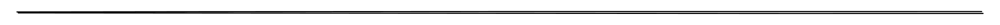

# Testnet



`Deploy Time`: Jul-07-2023 06:58:12 AM +UTC

`Tag`: `Latest (0.9.0)`

`zkLink Version`: [b39c90da2b49ec61402d1359a07adf3090f51735](https://github.com/zkLinkProtocol/zklink-periphery/commit/b39c90da2b49ec61402d1359a07adf3090f51735) (private)

<table><thead><tr><th width="242">Network</th><th>Contract Address</th></tr></thead><tbody><tr><td>Goerli Testnet</td><td><a href="https://goerli.etherscan.io/address/0x4e1ed4eccaf6a56e8da95cbb3d2c5aa298d43913">0x4e1ed4eccaf6a56e8da95cbb3d2c5aa298d43913</a></td></tr><tr><td>zkSync Era Testnet</td><td><a href="https://goerli.explorer.zksync.io/address/0x2b068879129a7a5e397a06a067a46cf3f158287d">0x2b068879129a7a5e397a06a067a46cf3f158287d</a></td></tr><tr><td>Linea Goerli Testnet</td><td><a href="https://explorer.goerli.linea.build/address/0xdDa221Cc960f8af74f90c04bfd05dD224CE1FcB8">0xdda221cc960f8af74f90c04bfd05dd224ce1fcb8</a></td></tr><tr><td>Bsc Testnet</td><td><a href="https://testnet.bscscan.com/address/0x8a7e5ad62af369be612a142d7211d336e4c877ac">0x8a7e5ad62af369be612a142d7211d336e4c877ac</a></td></tr><tr><td>Polygon Testnet</td><td><a href="https://mumbai.polygonscan.com/address/0x162cf62e14eca1abcf89a88f9a21e1d2632b6446">0x162cf62e14eca1abcf89a88f9a21e1d2632b6446</a></td></tr><tr><td>Avax Testnet</td><td><a href="https://testnet.snowtrace.io/address/0xe691cd1445599b02f1e69591942479910834c673">0xe691cd1445599b02f1e69591942479910834c673</a></td></tr><tr><td>Arbitrum Testnet</td><td><a href="https://goerli.arbiscan.io/address/0xa216d959bcaa5937ca876a70eec41080ff6172ce">0xa216d959bcaa5937ca876a70eec41080ff6172ce</a></td></tr></tbody></table>



`Deploy Time`: May-15-2023 03:09:23 AM +UTC

`Tag`: `0.6.0`

`dApps: ZKEX`

`zkLink Version`: [027ccd51356fbefbd98c7d1c8d09975f7728d29a](https://github.com/zkLinkProtocol/zklink-periphery/commit/027ccd51356fbefbd98c7d1c8d09975f7728d29a) (private)

<table><thead><tr><th width="242">Network</th><th>Contract Address</th></tr></thead><tbody><tr><td>Goerli Testnet</td><td><a href="https://goerli.etherscan.io/address/0xC668dE72C9eb10870D52E618A44f4182d428825e">0xC668dE72C9eb10870D52E618A44f4182d428825e</a></td></tr><tr><td>zkSync Era Testnet</td><td><a href="https://goerli.explorer.zksync.io/address/0xa2e2Bc5ce03443BeC5094cEd04BF8E0EC887aDC9">0xa2e2Bc5ce03443BeC5094cEd04BF8E0EC887aDC9</a></td></tr><tr><td>Scroll Alpha Testnet</td><td><a href="https://blockscout.scroll.io/address/0x378de89c13df5e428d9f1edff4ae305764d592e2">0x378de89c13df5e428d9f1edff4ae305764d592e2</a></td></tr><tr><td>Linea Goerli Testnet</td><td><a href="https://explorer.goerli.linea.build/address/0x4931cb9e5fc58be00c5fd133d0961347f3406b86">0x4931cb9e5fc58be00c5fd133d0961347f3406b86</a></td></tr><tr><td>Bsc Testnet</td><td><a href="https://testnet.bscscan.com/address/0x0473ecc194462dd4010c6be0d1dac73e7ca9fc7f">0x0473ecc194462dd4010c6be0d1dac73e7ca9fc7f</a></td></tr><tr><td>Polygon Testnet</td><td><a href="https://mumbai.polygonscan.com/address/0x4d6f405639f4bcf3e58505ee0965ae2cb4201be3">0x4d6f405639f4bcf3e58505ee0965ae2cb4201be3</a></td></tr><tr><td>Avax Testnet</td><td><a href="https://testnet.snowtrace.io/address/0x2096eAD9d82ca596Ca807e82b2D61c15aDCb5fFF">0x2096eAD9d82ca596Ca807e82b2D61c15aDCb5fFF</a></td></tr></tbody></table>

`Deploy Time:` Apr-28-2023 05:37:24 AM +8 UTC

`Tag: Dunkirk`

`dApps: ZKEX`

`zkLink Version:` [4f909ef1da5a8f62b6c4a38c80319be6d2da40ef](https://github.com/zkLinkProtocol/zklink-periphery/commit/4f909ef1da5a8f62b6c4a38c80319be6d2da40ef) (private)

<table><thead><tr><th width="245">Network</th><th>Contract Address</th></tr></thead><tbody><tr><td>Goerli Testnet</td><td><a href="https://goerli.etherscan.io/address/0x4d116306C418010F85d6905457239349914bF1Cd">0x4d116306C418010F85d6905457239349914bF1Cd</a></td></tr><tr><td>Scroll Alpha Testnet</td><td><a href="https://blockscout.scroll.io/address/0xcC85Ae89DC053e34a58f04e88571644F41A0e5c0">0xcC85Ae89DC053e34a58f04e88571644F41A0e5c0</a></td></tr><tr><td>Linea Goerli Testnet</td><td><a href="https://explorer.goerli.linea.build/address/0xc04A47344C362b6a4DD1E7b7Fd080ac6ABA36C95">0xc04A47344C362b6a4DD1E7b7Fd080ac6ABA36C95</a></td></tr><tr><td>Bsc Testnet</td><td><a href="https://testnet.bscscan.com/address/0x15ee6c6360f62db16250B84A2efDA48f001740E8">0x15ee6c6360f62db16250B84A2efDA48f001740E8</a></td></tr><tr><td>Polygon Testnet</td><td><a href="https://mumbai.polygonscan.com/address/0xd5a67aE094D26451C5CE592798C9CaDE55f968aa">0xd5a67aE094D26451C5CE592798C9CaDE55f968aa</a></td></tr><tr><td>Avax Testnet</td><td><a href="https://testnet.snowtrace.io/address/0x7a185Fa2CC782639bCEeb28ecD0cD85b8709EC98">0x7a185Fa2CC782639bCEeb28ecD0cD85b8709EC98</a></td></tr></tbody></table>

***
