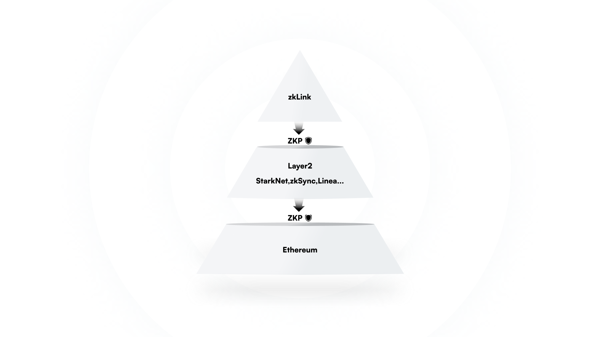

# Nexus: Settlement on ETH ZK-L2s

A zkLink Nexus L3 rollup settles the transactions and transition of states directly on Ethereum's L2s, and the L2s settle on Ethereum. Hence the finality of the transactions on a zkLink Nexus L3 rollup will be ultimately achieved on Ethereum layer1.

<figure><figcaption>
Security inheritance of zkLink Nexus
</figcaption></figure>

The settlement process of a Nexus L3 rollup is shown above. Nexus rollup posts data and ZKP to the connected ZK-L2s, where the correctness of the states and transactions is verified via the verifier contract. Meanwhile, the L2s also post transactions and states to Ethereum with ZKP verified. In essence, from Nexus L3 to the L2s, and then to Ethereum, each step is verifiable with ZKP, ensuring the correctness of the L3 off-chain states. Therefore, it could be stated that a zkLink Nexus L3 rollup inherits the security of Ethereum.
