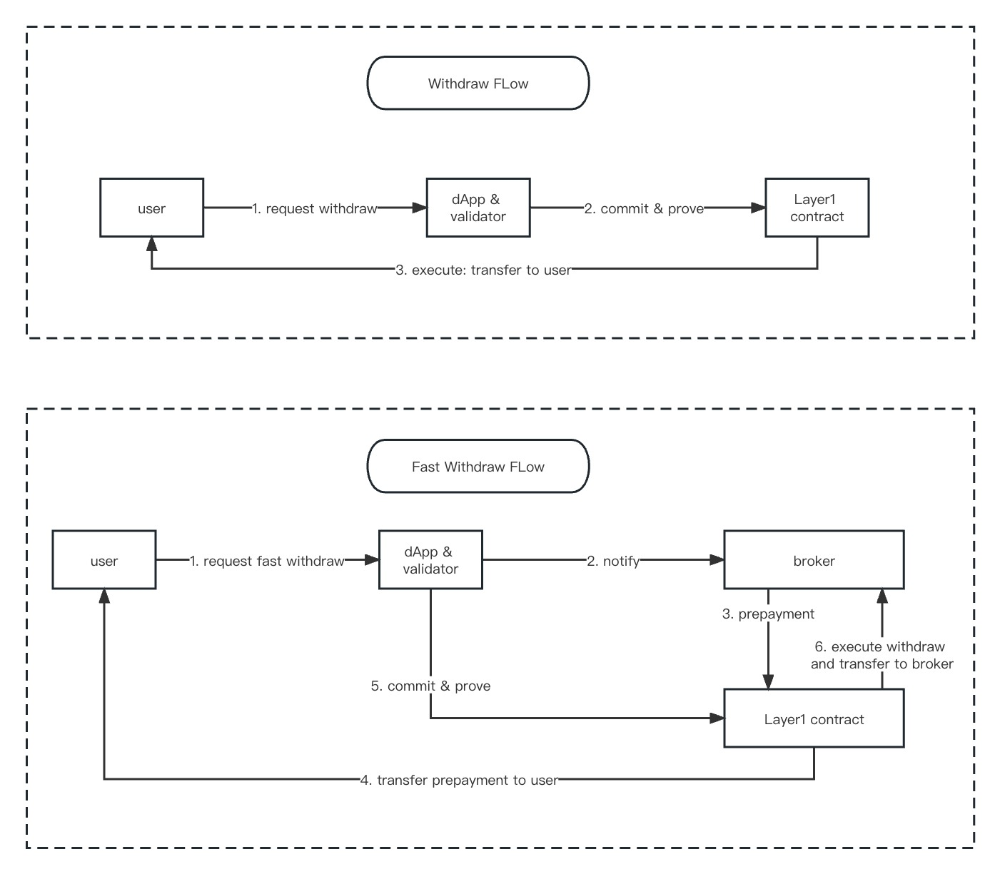

# Withdraw

---
There are 4 types of the withdraw function : withdraw, forced withdraw (permissionless),  proxy withdraw, and Dunkirk exit.

---
## Withdraw Calls

- Layer1 operations
    - Forced Withdraw
        - call zklink forced_withdraw function
    - Dunkirk Exit
        - call zklink dunkirk_exit function (when zkLink enters Dunkirk mode)
- Layer2 operations
    - Withdraw
        - EVM signature:  ECDSA(EIP712,secp256k1) & EDDSA(alt_babyjubjub)
        - nonEVM signature: ECDSA ([Stark Curve](https://docs.starkware.co/starkex/crypto/stark-curve.html)) & EDDSA ([alt_babyjubjub](https://docs.rs/sapling-crypto_ce/latest/sapling_crypto_ce/alt_babyjubjub/index.html))
    - Proxy Withdraw
        - EVM signature：ECDSA(EIP712,secp256k1) & EDDSA(alt_babyjubjub)
        - nonEVM signature: ECDSA ([Stark Curve](https://docs.starkware.co/starkex/crypto/stark-curve.html)) & EDDSA ([alt_babyjubjub](https://docs.rs/sapling-crypto_ce/latest/sapling_crypto_ce/alt_babyjubjub/index.html))
        - proxy withdraw applies to:
            - address that can not generate pubkeyhash. For example, a user mistakenly transfers tokens to a smart contract address that does not support generation of pubkeyhash. To withdraw the token from Layer2 to Layer1 in such a case, a third party proxy is required to send the withdraw request . Noted that the to_address must be a smart contract address.


## Fast Withdraw


>💡 **Fast Withdraw** is not a Layer2 function, but a supplementary feature to Layer2 withdraw function.


zkLink verify contract supports Brokers to prepay the withdrawal to users as a substitute to regular withdraws, only if the user agree to pay the broker fee. 

The record of prepayment information is stored in Layer1 smart contracts. When a withdraw is zk_verified on-chain, the according prepayment record will be checked in `accepts`; if it is included, the to_address will be replaced with the broker address.

Note:

- The serial execution of the broker logic defined in the smart contract makes sure that: 1. multiple brokers cannot take the same fast withdraw request simultaneously; 2. a single request cannot be approved multiple times.
- The broker records are stored in the contract. Once the prepayment is successfully executed, the broker will definitely receive the prepaid principal.

```
	/// @dev Accept infos of fast withdraw of account
    /// uint32 is the account id
    /// byte32 is keccak256(abi.encodePacked(receiver, tokenId, amount, withdrawFeeRate, nonce))
    /// address is the accepter
    mapping(uint32 => mapping(bytes32 => address)) public accepts;

    /// @dev Broker allowance used in accept, accepter can authorize broker to do accept
    /// @dev Similar to the allowance of transfer in ERC20
    /// @dev The struct of this map is (tokenId => accepter => broker => allowance)
    mapping(uint16 => mapping(address => mapping(address => uint128))) internal brokerAllowances;
```

