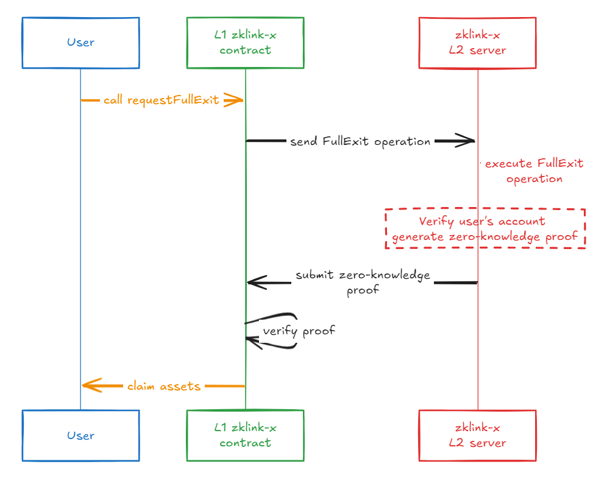

# Withdraw

There are 4 types of withdraw functions: withdraw, forced withdraw (permissionless), proxy withdraw, and Dunkirk exit.

## Withdraw Calls

<table><thead><tr><th width="125">Calls</th><th width="225">EVM Signature</th><th>NonEvm Signature</th><th>Comment</th></tr></thead><tbody><tr><td>Forced Withdraw</td><td>• <code>ECDSA</code>(<a href="https://en.bitcoin.it/wiki/Secp256k1">secp256k1</a>)</td><td>• <code>ECDSA</code>(<a href="https://docs.starkware.co/starkex/crypto/stark-curve.html">Stark Curve</a>)</td><td>On-chain transaction that needs to be initiated towards the according networks</td></tr><tr><td>Dunkirk Exit</td><td>• <code>ECDSA</code>(<a href="https://en.bitcoin.it/wiki/Secp256k1">secp256k1</a>)</td><td>• <code>ECDSA</code>(<a href="https://docs.starkware.co/starkex/crypto/stark-curve.html">Stark Curve</a>)</td><td>On-chain transaction that needs to be initiated towards the according networks</td></tr><tr><td>Withdraw</td><td>• <code>ECDSA</code>(<a href="https://eips.ethereum.org/EIPS/eip-712">EIP712</a>, <a href="https://en.bitcoin.it/wiki/Secp256k1">secp256k1</a>)<br>• <code>EDDSA</code>(<a href="https://docs.rs/sapling-crypto_ce/latest/sapling_crypto_ce/alt_babyjubjub/index.html">alt_babyjubjub</a>)</td><td>• <code>ECDSA</code> (<a href="https://docs.starkware.co/starkex/crypto/stark-curve.html">Stark Curve</a>)<br>• <code>EDDSA</code> (<a href="https://docs.rs/sapling-crypto_ce/latest/sapling_crypto_ce/alt_babyjubjub/index.html">alt_babyjubjub</a>)</td><td>zkLink L2 operation that requires two signatures: ECDSA for verification from dApp-end, and EDDSA for circuit verification</td></tr><tr><td>Proxy Withdraw</td><td>• <code>ECDSA</code>(<a href="https://eips.ethereum.org/EIPS/eip-712">EIP712</a>, <a href="https://en.bitcoin.it/wiki/Secp256k1">secp256k1</a>)<br>• <code>EDDSA</code>(<a href="https://docs.rs/sapling-crypto_ce/latest/sapling_crypto_ce/alt_babyjubjub/index.html">alt_babyjubjub</a>)</td><td>• <code>ECDSA</code> (<a href="https://docs.starkware.co/starkex/crypto/stark-curve.html">Stark Curve</a>)<br>• <code>EDDSA</code> (<a href="https://docs.rs/sapling-crypto_ce/latest/sapling_crypto_ce/alt_babyjubjub/index.html">alt_babyjubjub</a>)</td><td>zkLink L2 operation that requires two signatures: ECDSA for verification from dApp-end, and EDDSA for circuit verification</td></tr><tr><td>Comment</td><td>Ethereum, zkSync, Scroll, Linea, BSC, Polygon, Avalanche, etc.</td><td>In the current version, the only non-EVM network that zkLink supports is Starknet</td><td></td></tr></tbody></table>


`proxy withdraw` applies to accounts that can not generate pubkeyhash. For example, a user mistakenly transfers tokens to a smart contract address that does not support pubkeyhash generation. To withdraw the token from Layer2 to Layer1 in such a case, a third-party proxy is required to send the withdrawal request. Noted that the to\_address must be THE smart contract address.


## Forced Withdraw
### Function name
#### requestFullExit
Through the **requestFullExit** interface of the **zklink-X L1 contract**, users can withdraw the balance of any token from a specific sub-account on L2, and the funds will be withdrawn to the user's L1 address.
Forced Withdraw is a type of withdrawal operation, and it is the only withdrawal operation initiated by L1. The other two operations are withdrawals of L2.


**_Note_**: The accountId passed in must be the Account ID obtained by the caller msg.sender when registered on zklink-X L2.
By using the **[getAccount](../developer/api-and-sdk/json-rpc/json-rpc-api.md#getaccount)** and the **[getSupportTokens](../developer/api-and-sdk/json-rpc/json-rpc-api.md#getSupportTokens)** and the **[getAccountBalances](../developer/api-and-sdk/json-rpc/json-rpc-api.md#getaccountbalances)** three json-rpc interfaces of the zklink-x layer 2 service, you can find the Account_id corresponding to a given address and the token_id for tokens with a balance.

#### Principle Design
The FullExit instruction is an L1 priority instruction,
requiring zklink-X L2 to execute all L1 instructions in the exact order received from L1.
After L2 completes each L1 instruction and submits the zero-knowledge proof to the chain,
the zklink-X L1 contract will check the order and existence of each submitted priority instruction.
Any erroneous order or instruction will result in a rejection of L2's submission (commitBlocks) until it is corrected.
(In fact, there is a timeout set;
If there is no correct submission for too long, it will enter the **Dunkirk Exit** phase:
The [open-source reps](#https://github.com/zkLinkProtocol/recover_state_server) allowing users to submit proofs to withdraw their own funds.)



#### Permissions
none

#### Parameters
| Name          | Type   | Description                                                                   |
|---------------|--------|-------------------------------------------------------------------------------|
| _accountId    | uint32 | Account ID registered by the user in L2                                       |
| _subAccountId | uint8  | SubAccountId of the withdrawal                                                |
| _tokenId      | uint16 | Token id of the withdrawal                                                    |
| _mapping      | bool   | If true, the balance of the mapping token of the account is reduced in the L2 |

#### Return value
none

#### Constraints
| Name                                   | Type       | Description                                                                   |
|----------------------------------------|------------|-------------------------------------------------------------------------------|
| _accountId                             | Parameters | [0,MAX_ACCOUNT_ID]                                                            |
| _subAccountId                          | Parameters | [0,MAX_SUB_ACCOUNT_ID]                                                        |
| exodusMode                             | Status     | false                                                                         |
| token verification                     | Status     | token must be registered, and it has no effect on whether token is prohibited |
| totalOpenPriorityRequests Verification | Status     | [0,MAX_PRIORITY_REQUESTS)                                                     |

ExodusMode is true to indicate that ZkLink is in the exit state. In this state, the user is not allowed to perform FullExit.

#### Example
```
const { ethers } = require('ethers');
const contractABI = [
    {
        "inputs": [
            { "internalType": "uint32", "name": "_accountId", "type": "uint32" },
            { "internalType": "uint8", "name": "_subAccountId", "type": "uint8" },
            { "internalType": "uint16", "name": "_tokenId", "type": "uint16" },
            { "internalType": "bool", "name": "_mapping", "type": "bool" }
        ],
        "name": "requestFullExit",
        "outputs": [],
        "stateMutability": "nonpayable",
        "type": "function"
    }
];

const contractAddress = '0xzklinkXContractAddressHere';
const contract = new ethers.Contract(contractAddress, contractABI, wallet);

async function callRequestFullExit(accountId, subAccountId, tokenId, mapping) {
    try {
        const tx = await contract.requestFullExit(accountId, subAccountId, tokenId, mapping);

        const receipt = await tx.wait();

        console.log('Transaction successful:', receipt);
    } catch (error) {
        console.error('Error calling requestFullExit:', error);
    }
}

callRequestFullExit(10, 1, 100, true);
```

## Fast Withdraw

> 💡 **Fast Withdraw** is not a Layer2 function, but a supplementary feature to Layer2 withdraw function.

zkLink verify contract supports Brokers to prepay the withdrawal to users as a substitute to regular withdraws, only if the user agrees to pay the broker fee.

The record of prepayment information is stored in Layer1 smart contracts. When a withdrawal is zk\_verified on-chain, the according prepayment record will be checked in `accepts`; if it is included, the to\_address will be replaced with the broker address.


* The serial execution of the broker logic defined in the smart contract makes sure that: 1. multiple brokers cannot take the same fast withdraw request simultaneously; 2. a single request cannot be approved multiple times.
* The broker records are stored in the contract. Once the prepayment is successfully executed, the broker will definitely receive the prepaid principal.


```
/// @dev Accept infos of fast withdraw of account
/// uint32 is the account id
/// byte32 is keccak256(abi.encodePacked(receiver, tokenId, amount, withdrawFeeRate, nonce))
/// address is the accepter
mapping(uint32 => mapping(bytes32 => address)) public accepts;

/// @dev Broker allowance used in accept, accepter can authorize broker to do accept
/// @dev Similar to the allowance of transfer in ERC20
/// @dev The struct of this map is (tokenId => accepter => broker => allowance)
mapping(uint16 => mapping(address => mapping(address => uint128))) internal brokerAllowances;
```


