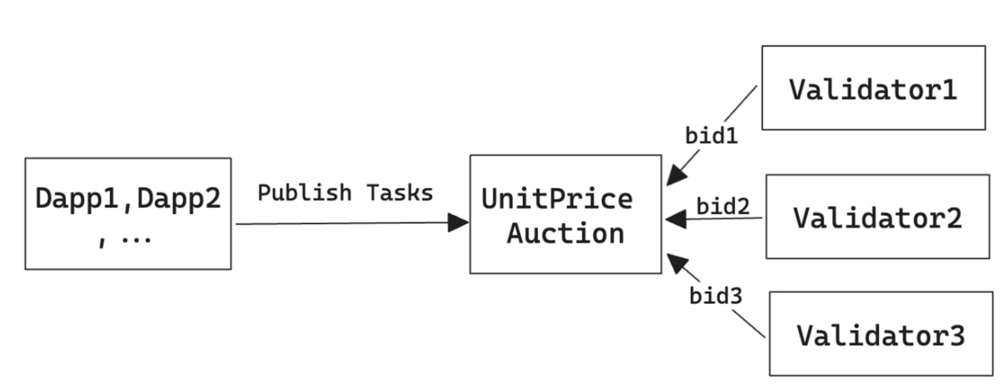
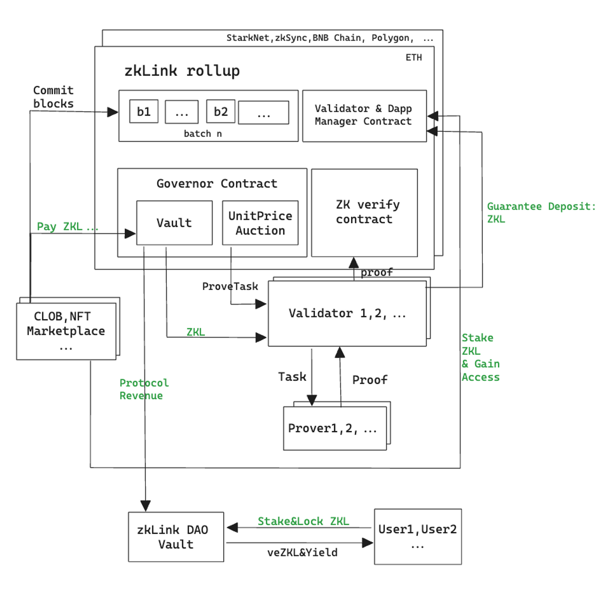

# Tokenomics

ZKL, the utility token and governance token of zkLink protocol, is a standard ERC20 token, and its smart contract code is derived from the ERC20 contract provided by [OpenZeppelin](https://github.com/OpenZeppelin/openzeppelin-contracts/blob/master/contracts/token/ERC20/ERC20.sol).

The total amount of ZKL will be kept at 1 billion and non-inflationary. There will be no individual or entity that can issue new units of ZKL.

### ZKL as zkLink block fee

ZKL token is the de facto payment token for the dApps to access the zkLink service and pay for the usage of the network block space.

When the dApp server commits a block to the zkLink contract, it has to pay for the validator service in ZKL:

`block_fee = total_block_unit * unit_price`

wherein:

1. `unit_price` is equal to the lowest bid among the validators;
2. `total_block_unit` is the sum of units of transactions in one block;
3. unit is the computing cost of each operation.

<figure><figcaption></figcaption></figure>

### ZKL as governance token

1. dApps have to stake ZKL to gain access to manager contract;
2. validators have to stake ZKL as a guarantee deposit, and help generate zero-knowledge proofs to receive ZKL as rewards;
3. Users of the zkLink Eco dApps will be motivated to purchase and hold ZKL to unlock perks and special user rights such as trading fee discounts;
4. ZKL holders can stake ZKL to obtain veZKL to initiate proposals, and vote on the proposals to govern the development of the protocol.

<figure><figcaption></figcaption></figure>
