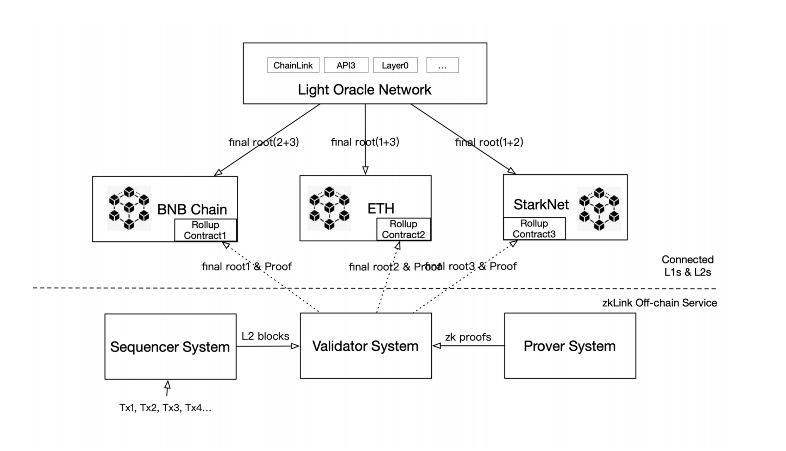

# Protocol Overview

<figure><figcaption></figcaption></figure>

## Types of Networks that zkLink supports

Unless otherwise specified, the “Layer1” mentioned in this documentation refers to the various ecosystems that zkLink connects to, including but not limited to:

EVM-compatible public chains

`Ethereum Mainnet`, `BNB Chain`, `Polygon`, `Avalanche`, etc,.

EVM-compatible ZK-Rollup VMs

`zkSync`, `Scroll`, `Linea`, `Polygon` `ZKVM`, `Taiko`, etc,.

EVM-incompatible ZK-Rollup VMs

`Starknet`, etc,.

EVM-compatible Optimistic-Rollups

`Arbitrum`, `Optimism`, etc,.

The list above is not comprehensive. The purpose is to deploy zkLink main contract only on secure and reliable ecosystems recognized by community. Emails suggesting new networks that zkLink should be connected to are welcomed.


To avoid misunderstanding, we use "zkLink Layer2" or "zkLink off-chain rollup service" to refer to the infrastructure that zkLink developed. Although zkLink is more like a Layer3 network considering other Layer2s such as Starknet or zkSync that zkLink connects to, we identify zkLink as a Layer2 solution.


<figure><figcaption></figcaption></figure>

## Roles in the zkLink Ecosystem

<table data-header-hidden><thead><tr><th width="229"></th><th></th></tr></thead><tbody><tr><td>User</td><td>Users of dApps that are deployed on the zkLink infrastructure. 👉 <a href="Architecture.md#user-interactions">User Interactions</a></td></tr><tr><td>dApp Developers</td><td>Developers who build dApps and can also act as Sequencers. In some cases, dApp developers may not need to run their own Sequencer, as the zkLink team provides a shared Sequencer service.</td></tr><tr><td>Collection of target chains</td><td>Various Layer1 and Layer2 ecosystems that zkLink connects can be combined into a single network module. zkLink service can be customized and deployed on any compatible network module. 👉 <a href="../networks/testnet_networks.md">Connected Network</a></td></tr><tr><td>Data Availability Layer</td><td>Different DA solutions are available including internal and external DAs. zkLink provides multiple options for developers to choose from. 👉 Data Availability</td></tr><tr><td>Light Oracle Network</td><td>In certain network configurations, zkLink architecture requires the assistance of a light oracle network for inter-chain communication. This is dependent on the specific version of zkLink rollup and the combination of connected ecosystems.</td></tr><tr><td>Community Participants</td><td>- Validators: coordinate with provers and upload ZKPs on-chain; receive incentives; - Provers: generate zero-knowledge proofs to receive incentives; - zkLink DAO: conduct governance activities for the stability of zkLink protocol; receive incentives.</td></tr><tr><td>zkLink Team</td><td>Develop, iterate, and maintain the zkLink protocol; coordinate with dApps and the community.</td></tr></tbody></table>

## User Interactions

1. Users interact with dApps' front-end. In the backstage, tokens deposited to the dApp will be locked in the zkLink contract (which may be exclusively deployed for a specific dApp). Users need to wait for a certain period of time (determined by the source chain) before the dApp receives this deposit.
2. Once the dApp confirms the deposit, the user will be able to see it in their balance and use other dApp features. In the case of ZKEX.com, users can do multi-chain spot trading or open positions in perpetual contracts after receiving the deposit. Read Deposit Flow for more details.
3. Users can withdraw tokens at any time. They can either request on the dApp’s front-end or directly submit the withdrawal request to zkLink main contract. Read Withdraw Flow for more details.

`Note`

1. Tokens might not necessarily be deposited directly from the user account into the zkLink main contract; developers can deploy separate proxy deposit contracts for higher flexibility. For example, zkJump deploys a proxy deposit contract and realizes bridging fee collection.
2. In some cases users will also interact directly with zkLink: forced withdraw (users initiate forced withdraw directly to zkLink Layer1 contract), and Dunkirk exit (users directly withdraw tokens from zkLink main contract when zkLink enters Dunkirk mode, which is irreversible)


About Dunkirk: the “Dunkirk Asset Recovery” program has been publicly tested to simulate the extreme case: when zkLink server is down, users can retrieve their assets via the open-source recovery program.


## Developer Integrations

### Understand the development needs

* zkLink is a unified multi-chain trading infrastructure secured with zk-SNARKS;
* zkLink excels at peer-to-peer trading scenarios, particularly order book trading;
* zkLink currently supports spot trading and derivative trading;
* zkLink currently supports depositing and merging of OFT, enabling OFT cross-chain transfers:
  1. for example, USDC is issues on both Ethereum and BSC, and can be deposited to zkLink from either chain; users can deposit from Ethereum and withdraw to BSC;
  2. merge: the same kind of token on different chains are automatically merged into a unified one on zkLink;
* zkLink will soon support the issuance and trading of NFTs;
* zkLink is not designed for direct integration with on-chain DeFi protocols or other Layer1 smart contracts. As an independent rollup infrastructure, zkLink acquires cost advantages at the expense of composability.

### Explore integration examples

* [Heavyweight Integration (Multi-Chain Derivatives & Spot Exchange)](../IntegrationArchitecture/Derivatives.md)
* [Simple Integration (Multi-Chain Spot Exchange)](../IntegrationArchitecture/spot.md)
* [Lightweight Integration](../IntegrationArchitecture/zkjump.md)

### Steps to develop on zkLink

1. Contact the zkLink team (dev@zklink.org) about integration details;
2. Stake a certain amount of tokens with the zkLink DAO to gain access to Sequencer system (optional; you can also opt for the shared Sequencer service);
3. Launch your product once everything is set up.

## Network Collections

👉 [Currently Connected Networks](../networks/testnet\_networks.md)

zkLink supports diversified deployment of the following collections:

* \[Ethereum mainnet] + \[ZK-Rollup VMs deployed on Ethereum mainnet];
* \[Ethereum mainnet] + \[Rollup VMs deployed on Ethereum mainnet];
* \[Ethereum mainnet] + \[other mainstream alt EVM compatible Ecosystems] + \[Rollup VMs deployed on Ethereum mainnet];


Currently zkLink is not connected to other public chain in non-EVM ecosystems, such as Solana, Algorand, etc,.


The required network module for different deployment collections varies. For example, with the first and second deployment collections above, the involvement of the light oracle network is optional, and the network configuration can be adjusted according to specific requirement of dApps.&#x20;

## Data Availability Layer

There are three scenarios of zkLink DA deployment: internal DA, external DA, and the mixture of both internal and external DA.&#x20;



Currently the classic zkLink architecture is to choose one or more target chains to put DA on, i.e., internal DA, which is recognized as the more secure DA option.





Different types of dApps may have various requirement for DA. There are several options in the data availability layer of zkLink protocol, including but not limited to DAC (data availability committee), EigenDA, and Celestia.



## Community Participants

### Validator

**How to become a validator?**

* stake a certain amount of token;
* own a server that meets the performance requirement to run the circuit.

**What will a validator do?**

* listen to on-chain events (the Layer2 block data committed by dApps);
* maintain the circuit state tree, generate data needed in ZKP generation and assort it to provers.

**What incentives will a validator get?**

* a validator bids for the right to construct the entire block;
* if a validator fails to submit the ZKP within the time limit, the according incentives will be deducted and even the stakes will be confiscated.

### Prover

> 💡 In zkLink design, a Prover is more like an affiliate of the Validator system and does not directly interact with zkLink protocol.

**How to become a prover**

* authorized by the Validator system;
* own a server that meets the performance requirement.

**What will a prover do?**

* run the Prover program, which may be bound to one or more validators

## zkLink DAO

> 💡 Check [Tokenomics](broken-reference) for detailed information

