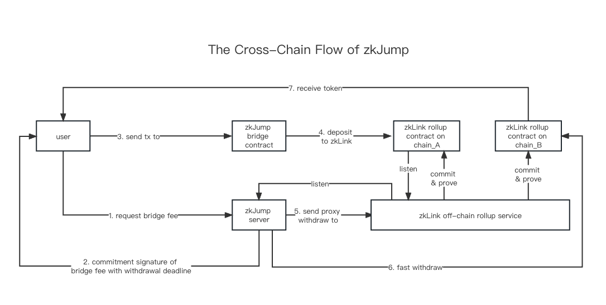

# zkJump Architecture

zkJump is an OFT cross-chain protocol on top of zkLink infrastructure that supports:

* Omnichain Fungible Token(OFT) Issuing and Transfer
* Multi-chain asset management
* Cross-chain transfer of multi-chain assets

<figure><figcaption></figcaption></figure>
